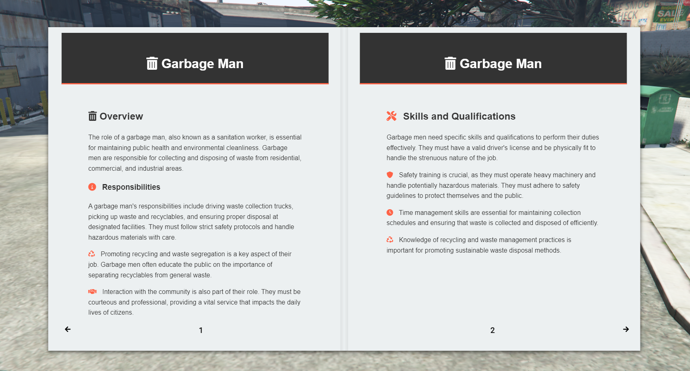
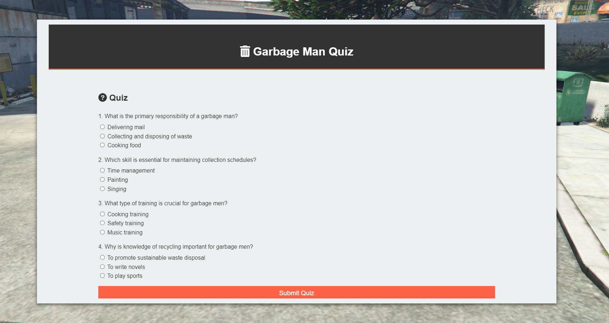
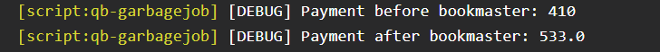
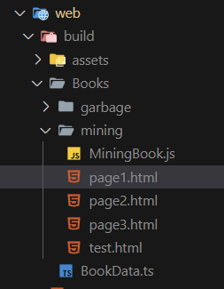
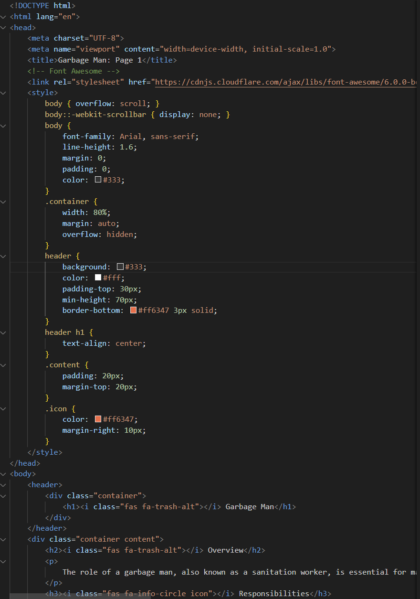
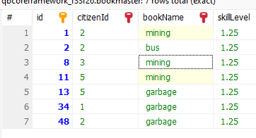
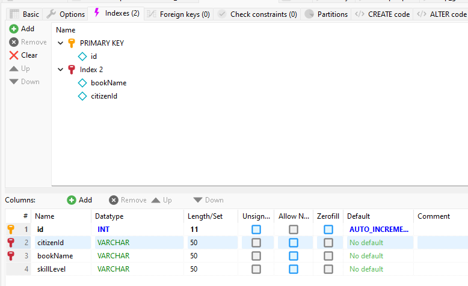

# Bookmaster - Read for Skill

This system will help your community get paid more based on how much they are willing to spend on education :)

Once you decide a job on which to write a book, the players can purchase it and get extra experience / money based on the skill level they have.

### Join the [Discord](https://discord.gg/bx6fs2AeWC) for support and updates


## Showcase




--- 
It will change the money recieved based on your skill level



### 😄 Integrate easily using a 1-liner solution:
```lua
totalToPay = exports['bookmaster']:getPlayerSkillLevel(src, 'garbage') * totalToPay
```

## Installation

1. Download the resource
2. Add the resource to your server.cfg


## Adding books


### Stage 1 - preparing QB base

Open `qb-core/shared/items.lua`
Insert items like so:
```lua
bookgarbage                     = { name = 'bookgarbage', label = 'Book for Garbage Job', weight = 1, type = 'item', image = 'BookGarbage.png', unique = true, useable = true, shouldClose = true, combinable = nil, description = 'Book for the garbage job' },
```

Now you can use the bookgarbage item by adding it in the `server/useableBooks.lua`

```lua
QBCore.Functions.CreateUseableItem("bookgarbage", function (source, item)
    TriggerClientEvent("bookmaster:client:openBook", source, "garbage")
end)
```

(the "garbage" is the job name and the bookdata refrence)

### Stage 2 - React and UI integration via `iframes`

1. Go to `web/public/BookData.ts`
2. Add your layout:
```ts
const BookData = {
    "mining": {
        "pages": [
            //...
        ],
        "test": "test.html"
    },
    "garbage": {
        "pages": [
            //...
        ],
        "test": "test.html"
    },

    "your new job": {
        "pages": [
            //...
        ],
        "test": "test.html"
    }
}


export default BookData
```

3. Write your book 💙

I have provided a template that you can copy from `web/public/Books/*` and use it to create your own book with your own content.



---
> snippet down below

---

4. Integrate easily using a 1-liner solution:
```lua
totalToPay = exports['bookmaster']:getPlayerSkillLevel(src, 'garbage') * totalToPay
```

## Structure




